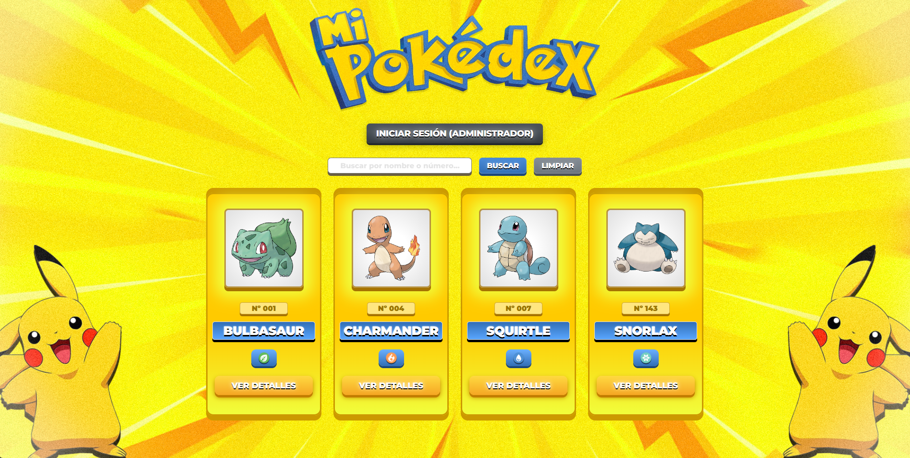
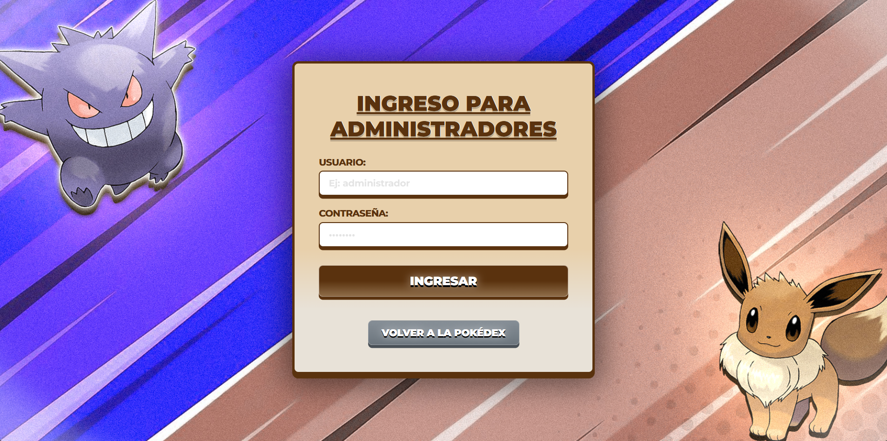
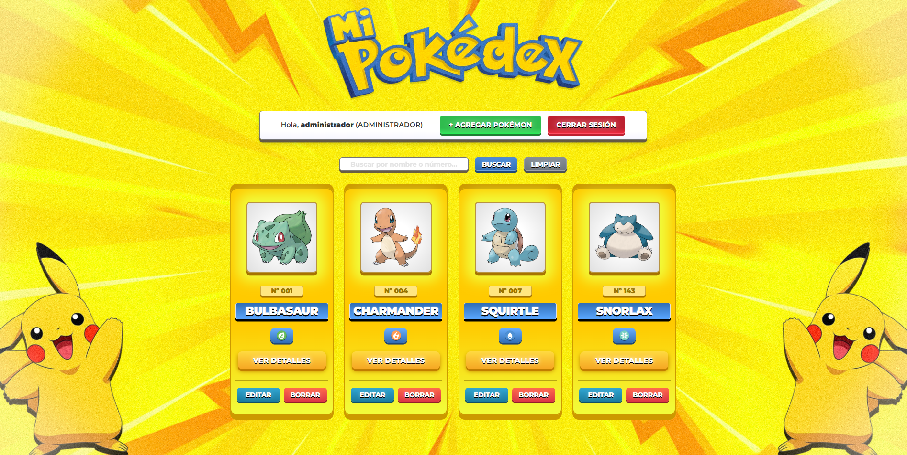
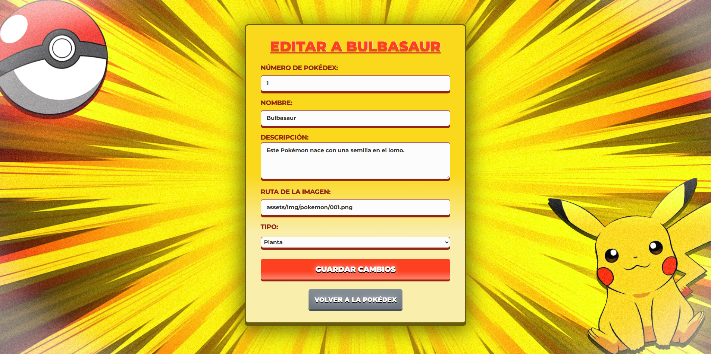
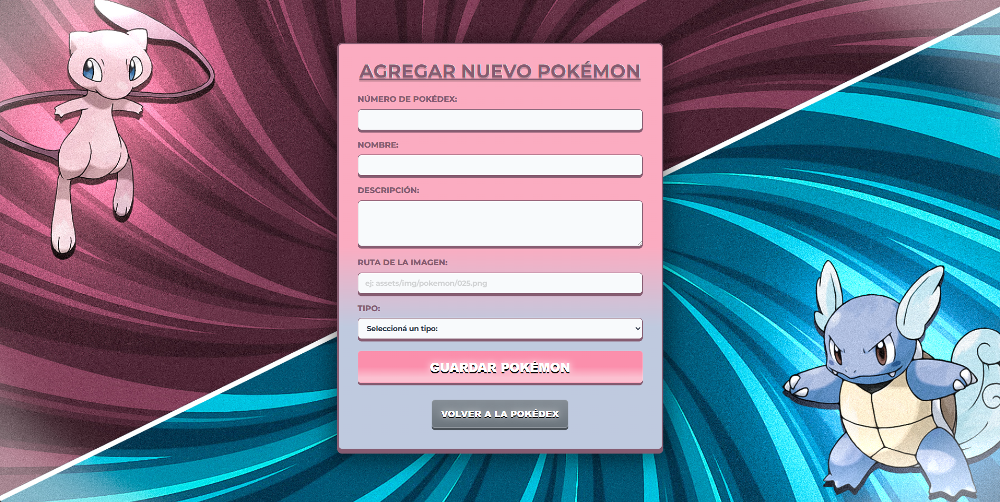

  <h1>🟡 Pokédex. 🟡</h1>

Proyecto práctico desarrollado para la materia <strong>Programación Web 2</strong>.

Pokédex es una aplicación web dinámica e interactiva que representa una Pokédex completa. Permite a los usuarios consultar y buscar información detallada de distintos Pokémon, e incluye un panel de administración restringido con sistema ABM (Alta, Baja y Modificación) persistido en base de datos.

  
   
<h2>✨ CARACTERÍSTICAS: </h2>

🔐 Sistema de autenticación de administrador mediante sesiones (`$_SESSION`). 
🔍 Buscador por nombre o número único de Pokédex. 
📋 Listado general con tarjetas descriptivas. 
🏷️ Representación visual de los tipos (Fuego, Agua, Planta, etc.) mediante imágenes. 
📖 Vista individual de detalle en página completa. 
➕ Formulario de alta para registrar nuevos Pokémon y subir su imagen. 
✏️ Edición de datos y rutas de imagen para Pokémon existentes. 
❌ Eliminación física de registros en la base de datos. 

 

<h2>⚙️ FUNCIONAMIENTO DEL SISTEMA: </h2>

1. 🌐 Ingresar a la página principal y explorar la lista de Pokémon. 
2. 🔍 Buscar un Pokémon específico por su nombre o número. 
3. 📖 Seleccionar un Pokémon para acceder a su ficha detallada. 
4. 🔐 Iniciar sesión en la plataforma con cuenta de administrador. 
5. ➕ Cargar nuevos Pokémon completando el formulario de alta. 
6. ✏️ Modificar la información o imágenes de los Pokémon registrados. 
7. ❌ Dar de baja registros que ya no correspondan. 
8. 🚪 Cerrar sesión de administración de forma segura.

 

<h2>📚 TECNOLOGÍAS UTILIZADAS: </h2>

### Backend:

### Frontend:

### Bases de datos y servidor:

### Herramientas:

  

<h2>📸 IMÁGENES DEL JUEGO: 📸</h2>

 

<h2>👥 INTEGRANTES: </h2>

<a href="https://github.com/Mikaaaaaaaaaaaaaaaaaaaaaaaaa" target="_blank">Mikaaaaaaaaaaaaaaaaaaaaaaaaa</a> 

 

<h2>📄 LICENCIA:</h2>

Proyecto desarrollado con fines académicos para la materia Programación Web 2.

